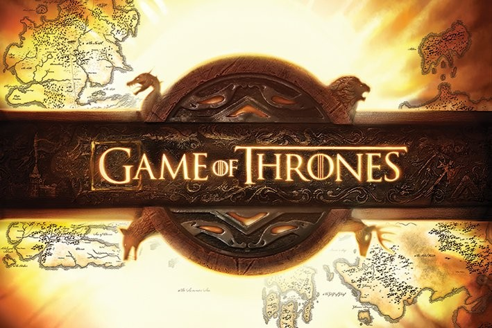

# Game of Thrones Quotes



Welcome to the "Game of Thrones Quotes" project! This React app fetches quotes from the `gameofthronesquotes.xyz` API and displays them. Users can generate a random quote or explore quotes by characters.

## Table of Contents

- [Features](#features)
- [Installation](#installation)
- [Usage](#usage)
- [API](#api)
- [Contributing](#contributing)

## Features

- Generate a random Game of Thrones quote.
- Explore quotes by characters.

## Installation

1.  Clone the repository:

    ```bash
    git clone https://github.com/Khawarmehfooz/got-quotes.git
    ```

2.  Change into the project directory:

    ```bash
    cd game-of-thrones-quotes
    ```

3.  Install dependencies:

    ```bash
    npm install
    ```

## Usage

1. Start the development server:

    ```bash
    npm run dev
    ```

2. Open the link you got in terminal. 

3. Explore random quotes or choose a character to see quotes related to them.

## API

This project uses the `gameofthronesquotes.xyz` API. You can find more information about the API [here](https://github.com/shevabam/game-of-thrones-quotes-api).

## Contributing

If you would like to contribute to the project, feel free to open issues or submit pull requests.